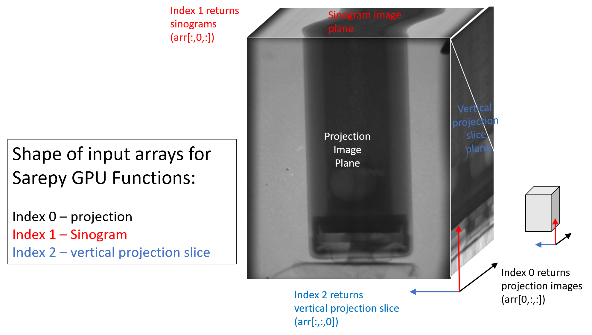

# cy_im_utils (Cyrus' Image Utils)

This should mostly just be functions, unless a class is really appropriate, it
will be simpler most of the time to just deal with numpy arrays.

**Default dtype : np.float32**

The most natural way to represent images as 3D arrays?
- index 1 = Image index (in the stack)
- index 2 = Column
- index 3 = Row

Need to think about a consistent image representation!

cy_im_utils is the root

branch tier 1:
- Prep? -> All high performance
  - GPU data reduction pipeline? (Radiographs -> Attenuation?)
  - Field
  - Imread -> Dask?
  - extract norm patch
- Extract?
  - patch_slice
- Visualization
  - template for an interactive plot
  - patch plotting
  - nif_99to01contrast
    - modified this to quantiles
- statistical testing
- Patch_extract

## sarepy_cuda (Sarepy GPU functions)

My adaptation of Vo et. al's SAREPY. Here are a few considerations for possible
efficiency boosts:
- All sarepy functions make a copy (i.e. not in-place) 
    - should this be a conditional or just hard code in-place operations?
    - Vo's code always makes a copy
- *nd_interp2d* is a function to replace *scipy.interpolate.interp2d*
    - this function is a bit hacky, but doesn't seem to be terribly
      inefficient.
    - a vectorized version of this would make me feel better
- *detect_stripe_GPU* has a for loop over all the sinograms that can easily
  be turned into a kernel
- I haven't done much testing to see if my default *threads_per_block* (8,8,8)
  is optimized

SAREPY GPU array format.
